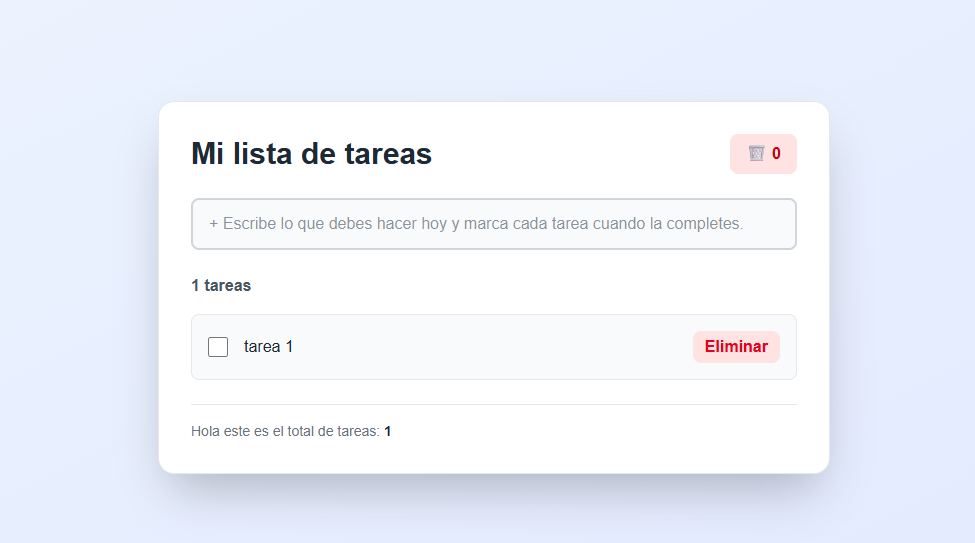
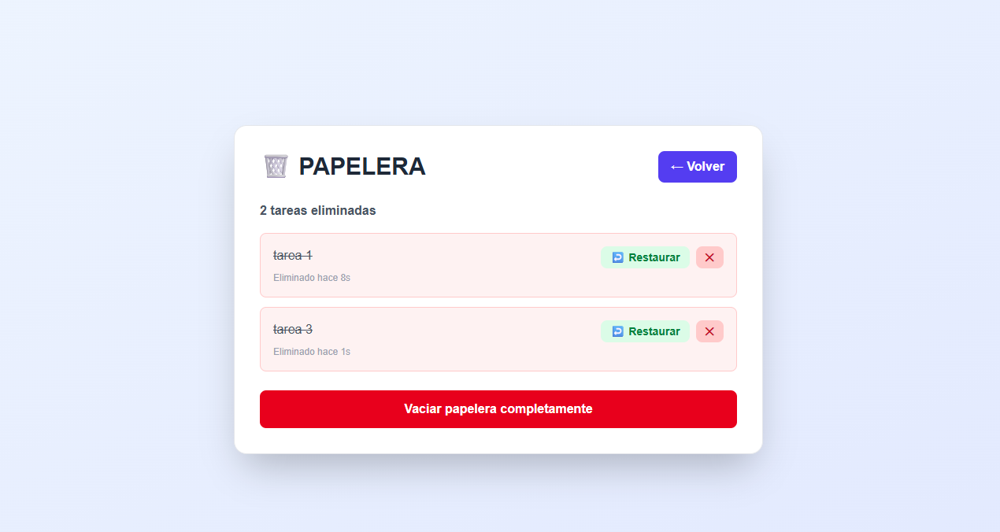
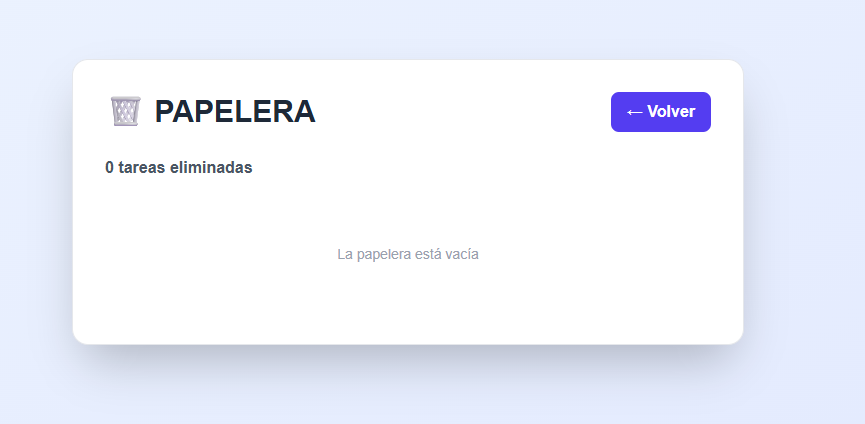

# 📋 Todo App - Gestor de Tareas con Papelera

Una aplicación moderna y responsiva de gestión de tareas construida con **Next.js 16**, **React 19** y **Tailwind CSS 4**. Incluye un innovador sistema de papelera para recuperar tareas eliminadas antes de borrarlas permanentemente.

---

## 👥 Integrantes del Equipo

| Nombre | Rol | GitHub |
|--------|-----|--------|
| Alexander David Barrios Diaz | Full Stack | [@usuario1](https://github.com/AlexanderBarriosd) | |


## Imágenes de referencia
   ![Vista principal con tareas] ("C:\Users\abarriosd\Pictures\Screenshots\Captura de pantalla 2026-09-12 131845.png")
---

## 🚀 Características Principales

### ✅ Gestión Completa de Tareas (CRUD)

#### **Crear (Create)**
- Escribe una tarea en el campo de entrada
- Presiona `Enter` para añadirla a la lista
- Sin necesidad de botón adicional (UX minimalista)

#### **Leer (Read)**
- Visualiza todas tus tareas en una lista organizada
- Contador de tareas totales
- Indicador de tareas completadas
- Estado visual diferenciado para tareas completadas

#### **Actualizar (Update)**
- **Completar tarea**: Usa el checkbox para marcar/desmarcar tareas
- **Editar tarea**: Haz clic en el texto de la tarea para editarlo
- **Autoguardado**: Los cambios se guardan automáticamente al salir del campo
- Presiona `Enter` para guardar rápidamente

#### **Eliminar (Delete)**
- Botón "Eliminar" rojo en cada tarea
- Las tareas se mueven a la **papelera** (no se borran inmediatamente)
- Opción de restaurar en cualquier momento

### 🗑️ Sistema de Papelera (NUEVA CARACTERÍSTICA)

#### **Acceso a la Papelera**
- Botón flotante con icono 🗑️ en la esquina superior derecha
- Muestra el contador de tareas eliminadas en tiempo real
- Cambio de vista con un solo clic

#### **Funcionalidades de la Papelera**
- **Restaurar tareas**: Devuelve cualquier tarea a tu lista principal
- **Eliminar permanentemente**: Borra definitivamente una tarea de la papelera
- **Vaciar papelera**: Elimina todas las tareas de una vez
- **Timestamp**: Visualiza cuándo fue eliminada cada tarea
  - Ejemplo: "Eliminado hace 5m", "Eliminado hace 2h", etc.

#### **Diseño de la Papelera**
- Vista separada y claramente diferenciada
- Tareas eliminadas con línea divisoria visual
- Botones de acción claramente identificados
- Confirmación de seguridad al vaciar la papelera

### 🎨 Diseño y Experiencia de Usuario

- **Interfaz moderna**: Gradientes suaves, sombras y bordes redondeados
- **Responsive**: Funciona perfectamente en desktop, tablet y móvil
- **Modo oscuro**: Tema oscuro nativo con soporte completo
- **Accesibilidad**: Inputs con focus visible, contraste adecuado
- **Animaciones suaves**: Transiciones en hover y al cambiar de vista
- **Feedback visual**: Estados claros para cada acción (hover, active, disabled)

---

## 📦 Instalación

### Requisitos Previos

- **Node.js** versión 18 o superior
- **npm** versión 9 o superior (o **yarn/pnpm**)
- Git instalado

### Pasos de Instalación

#### 1️⃣ Clonar el Repositorio

```bash
git clone https://github.com/tu-usuario/BPDS.git
cd BPDS
```

#### 2️⃣ Instalar Dependencias

```bash
npm install
```

Esto descargará e instalará todas las dependencias listadas en `package.json`:
- Next.js
- React
- Tailwind CSS
- Dependencias de desarrollo

#### 3️⃣ Verificar la Instalación

```bash
npm list next react tailwindcss
```

---

## 💻 Ejecutar el Proyecto Localmente

### Modo Desarrollo

```bash
npm run dev
```

Esto abre un servidor local en `http://localhost:3000` con **hot reload** automático.

**En tu navegador:**
- Abre [http://localhost:3000](http://localhost:3000)
- Cualquier cambio en el código se refleja instantáneamente
- La consola muestra errores en tiempo real

### Modo Producción

#### Compilar para Producción

```bash
npm run build
```

Genera una versión optimizada en la carpeta `.next`

#### Ejecutar Servidor de Producción

```bash
npm start
```

Inicia el servidor en `http://localhost:3000` (versión compilada)

### Otros Comandos Útiles

```bash
# Ejecutar linter (verificar código)
npm run lint

# Ejecutar tests (si están configurados)
npm test

# Limpiar caché
rm -rf .next
npm run build
```

---

## 🛠️ Stack Tecnológico

| Tecnología | Versión | Propósito |
|------------|---------|----------|
| **Next.js** | 16.3.4+ | Framework React con SSR/SSG |
| **React** | 19.2.8+ | Librería UI con Hooks |
| **TypeScript** | 5.0+ | Tipado estático y seguridad |
| **Tailwind CSS** | 4.0+ | Estilos utility-first |
| **PostCSS** | 8.0+ | Procesador de CSS |

---

## 📁 Estructura del Proyecto

```
BPDS-main/
├── app/
│   ├── layout.tsx          # Layout global con metadatos
│   ├── page.tsx            # Componente principal (Todo App)
│   └── globals.css         # Estilos globales y configuración Tailwind
├── public/                 # Archivos estáticos (favicon, etc)
├── node_modules/           # Dependencias instaladas
├── .gitignore              # Archivos ignorados por Git
├── package.json            # Dependencias y scripts
├── package-lock.json       # Lock file de npm
├── tsconfig.json           # Configuración de TypeScript
├── next.config.ts          # Configuración de Next.js
├── tailwind.config.ts      # Configuración de Tailwind CSS
├── postcss.config.mjs      # Configuración de PostCSS
├── AGENTS.md               # Reglas para agentes de IA
├── CLAUDE.md               # Referencia a AGENTS.md
└── README.md               # Este archivo
```

### Archivos Principales

#### `app/page.tsx`
- Componente principal con toda la lógica CRUD
- Estados: `todos`, `deletedTodos`, `newTodo`, `editingId`, `showTrash`
- Funciones: crear, leer, actualizar, eliminar, restaurar
- Interfaz de usuario completa

#### `app/layout.tsx`
- Estructura HTML base
- Metadatos (title, description, viewport)
- Providers globales

#### `app/globals.css`
- Variables CSS personalizadas
- Estilos globales
- Configuración de Tailwind

---

## 🎯 Funcionalidades por Versión

### v1.0.0 (Actual - Release)
- ✅ CRUD completo de tareas
- ✅ Sistema de papelera con restauración
- ✅ Edición en línea de tareas
- ✅ Modo oscuro completo
- ✅ Timestamps de eliminación
- ✅ Interfaz responsiva
- ✅ Confirmación de acciones destructivas
- ✅ Contador de tareas en tiempo real

### v0.1.0 (Beta - Histórico)
- ✅ Crear y eliminar tareas (v1)
- ✅ Marcar como completadas
- ✅ Dark mode básico

---

## 📸 Capturas de Pantalla

### 1️⃣ Vista Principal - Lista de Tareas



**Características mostradas:**
- ✅ Campo de entrada para nuevas tareas con placeholder descriptivo
- ✅ Lista de tareas con checkboxes para marcar como completadas
- ✅ Botón "Eliminar" en color rojo para cada tarea
- ✅ Contador de tareas en la esquina superior derecha (🗑️ 0)
- ✅ Estadísticas: Total de tareas y tareas completadas
- ✅ Diseño limpio y minimalista
- ✅ Interfaz responsiva en tablet/desktop

**Ejemplo:** "1 tareas" con una tarea llamada "tarea 1" y total visible al pie

---

### 2️⃣ Vista de Papelera - Tareas Eliminadas



**Características mostradas:**
- ✅ Encabezado "🗑️ PAPELERA" con botón "← Volver"
- ✅ Contador de tareas eliminadas: "2 tareas eliminadas"
- ✅ Cada tarea eliminada muestra:
  - Nombre tachado (strikethrough): "tarea 1", "tarea 3"
  - Timestamp relativo: "Eliminado hace 8s", "Eliminado hace 1s"
- ✅ Botón verde "↩️ Restaurar" para recuperar cada tarea
- ✅ Botón rojo "✕" para eliminar permanentemente
- ✅ Botón rojo grande "Vaciar papelera completamente" al pie
- ✅ Fondo rojo claro (#FEE2E2) para diferenciar de tareas activas

**Funcionalidad:** Permite recuperar tareas antes de eliminarlas permanentemente

---

### 3️⃣ Vista Principal - Papelera Vacía



**Características mostradas:**
- ✅ Encabezado "Mi lista de tareas" con botón papelera
- ✅ Contador de papelera en rojo: "🗑️ 0"
- ✅ Campo de entrada activo para nuevas tareas
- ✅ Lista con 1 tarea: "tarea 1" (sin completar)
- ✅ Botón "Eliminar" en rojo disponible
- ✅ Estadísticas al pie: "Hola este es el total de tareas: 1"
- ✅ Interfaz clara y llamativa
- ✅ Color de fondo suave (azul claro)

**Estado:** Papelera vacía (sin tareas eliminadas), lista lista para agregar más tareas

---

## 🔄 Flujo de Trabajo con Git

### Recomendaciones para Colaboración

#### Crear una Rama por Feature

```bash
# Crear y cambiar a rama nueva
git checkout -b feature/nueva-funcionalidad

# Trabajar en la rama
git add .
git commit -m "feat: descripción de cambios"

# Subir rama al remoto
git push origin feature/nueva-funcionalidad
```

#### Pull Requests

1. Crear PR desde GitHub
2. Descripción clara de cambios
3. Revisar cambios con compañeros
4. Aparece en los "Contributors"

#### Commit Messages (Convención)

```
feat:    Nueva característica
fix:     Correción de bugs
style:   Cambios de estilo (sin lógica)
docs:    Cambios en documentación
refactor: Refactorización de código
test:    Agregar o actualizar tests
chore:   Tareas de mantenimiento
```

Ejemplo:
```bash
git commit -m "feat: agregar sistema de papelera con restauración"
```

---

## 🧪 Testing (Futuro)

```bash
# Próximamente se agregará:
npm run test          # Ejecutar tests
npm run test:watch   # Tests en modo watch
npm run test:coverage# Cobertura de tests
```

---

## 🚢 Deployment

### Desplegar en Vercel (Recomendado para Next.js)

1. **Conectar repositorio GitHub a Vercel**
   - Ir a [vercel.com](https://vercel.com)
   - Click en "New Project"
   - Seleccionar tu repositorio GitHub

2. **Configurar variables de entorno** (si las hay)
   - No son necesarias en esta versión

3. **Deploy automático**
   - Vercel despliega automáticamente en cada push a `main`

---

## 📚 Recursos y Referencias

### Documentación Oficial

- [Next.js 16 Docs](https://nextjs.org/docs)
- [React 19 API Reference](https://react.dev/reference/react)
- [Tailwind CSS Docs](https://tailwindcss.com/docs)
- [TypeScript Handbook](https://www.typescriptlang.org/docs/)

### Tutoriales Relacionados

- [Next.js Tutorial - The Basics](https://nextjs.org/learn)
- [React Hooks Deep Dive](https://react.dev/reference/react/hooks)
- [Tailwind CSS Component Library](https://tailwindui.com)

### Heroes y Inspiración

- Equipo de Next.js
- Comunidad de React
- Vercel Platform

---

## 🐛 Troubleshooting

### Problema: `npm install` falla

**Solución:**
```bash
# Limpiar caché de npm
npm cache clean --force

# Eliminar node_modules y package-lock.json
rm -rf node_modules package-lock.json

# Instalar nuevamente
npm install
```

### Problema: Puerto 3000 en uso

**Solución:**
```bash
# Buscar qué proceso usa el puerto 3000
lsof -i :3000

# O usar otro puerto
npm run dev -- -p 3001
```

### Problema: Cambios no se reflejan en navegador

**Solución:**
- Limpiar caché del navegador (Ctrl+Shift+Delete)
- Reiniciar servidor: `Ctrl+C` y `npm run dev`
- Verificar que no haya errores en la consola

---

## 📝 Notas de Desarrollo

### Estado Local (Session Storage)

Actualmente, las tareas se almacenan en **estado local React** (se pierden al refrescar).

### Próximas Mejoras (Roadmap)

- 🔄 **Persistencia en LocalStorage**: Guardar tareas entre sesiones
- 🗄️ **Base de datos**: Integrar MongoDB/Firebase
- 🔐 **Autenticación**: Login con Google/GitHub
- 📱 **PWA**: Funcionamiento offline
- 📊 **Analytics**: Estadísticas de productividad
- 🎨 **Temas personalizados**: Más colores disponibles
- 📤 **Exportar/Importar**: Backup de tareas

---

## 👨‍💻 Contribuir

Para contribuir al proyecto:

1. **Fork** el repositorio
2. Crear una **rama feature** (`git checkout -b feature/AmazingFeature`)
3. **Commit** tus cambios (`git commit -m 'feat: Add some AmazingFeature'`)
4. **Push** a la rama (`git push origin feature/AmazingFeature`)
5. Abrir un **Pull Request**

---

## 📄 Licencia

Este proyecto está bajo la licencia **MIT**. Ver archivo `LICENSE` para más detalles.

---

## 📬 Contacto y Soporte

Para preguntas o sugerencias sobre el proyecto:

- 📧 Email: [tu-email@example.com](mailto:tu-email@example.com)
- 🐙 GitHub Issues: [Crear una issue](https://github.com/tu-usuario/BPDS/issues)
- 💬 Discusiones: [GitHub Discussions](https://github.com/tu-usuario/BPDS/discussions)

---

## 📊 Estadísticas del Proyecto

- **Lenguaje principal**: TypeScript/JavaScript
- **Líneas de código**: ~300
- **Archivos críticos**: 2 (page.tsx, globals.css)
- **Dependencias**: 10+
- **Commits**: [Ver en GitHub](https://github.com/tu-usuario/BPDS/commits)
- **Contributors**: 3
- **Última actualización**: Septiembre 2026

---

<div align="center">

### 🌟 ¡Si te gustó este proyecto, dale una estrella en GitHub! ⭐

**Hecho con ❤️ por el Equipo de BPDS**

[⬆ Volver al inicio](#-todo-app---gestor-de-tareas-con-papelera)

</div>
